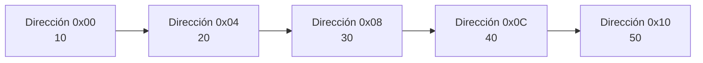
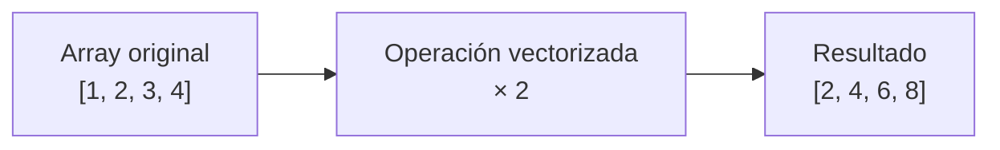
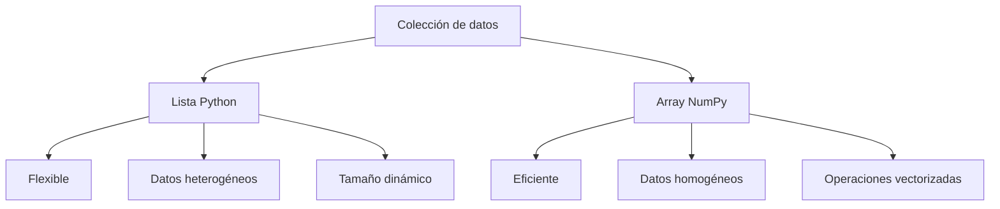

# Arrays NumPy

## ¿Qué son?

Los Arrays de NumPy son estructuras de datos especializadas para el procesamiento eficiente de datos numéricos. A diferencia de las listas tradicionales de Python, están diseñados para almacenar grandes cantidades de datos **homogéneos** y realizar operaciones matemáticas de forma extremadamente eficiente.

NumPy es una de las bibliotecas fundamentales del ecosistema científico de Python y constituye la base de herramientas como Pandas, Scikit-Learn, TensorFlow y SciPy.

---

## Almacenamiento contiguo en memoria

---

## Operaciones vectorizadas

---

## Array NumPy vs. Lista Python

---

## Características principales

- Estructura secuencial.
- Orden preservado.
- Acceso por índice.
- Datos **homogéneos** (mismo tipo).
- Operaciones vectorizadas.
- Tamaño relativamente fijo.
- Muy eficiente en memoria.

---

## Complejidad de operaciones

| Operación | Complejidad |
|---|---|
| Acceso por índice | O(1) |
| Recorrido | O(n) |
| Inserción | O(n) |
| Eliminación | O(n) |

---

## ¿Cuándo utilizar esta estructura?

- Procesamiento numérico intensivo.
- Ciencia de datos.
- Inteligencia artificial.
- Álgebra lineal.
- Simulaciones matemáticas.
- Procesamiento de señales.
- Procesamiento de imágenes.

## ¿Cuándo evitar esta estructura?

- Cuando los datos son heterogéneos.
- Cuando el tamaño cambia constantemente.
- Cuando se requieren muchas inserciones o eliminaciones.
- Cuando las necesidades son simples y una lista resulta suficiente.

---

## Ventajas y limitaciones

=== "Ventajas"
    - Altísima velocidad de procesamiento.
    - Bajo consumo de memoria.
    - Operaciones matemáticas optimizadas.
    - Excelente integración con bibliotecas científicas.

=== "Limitaciones"
    - Menor flexibilidad.
    - Solo admite datos homogéneos.
    - Inserciones costosas.
    - Requiere biblioteca externa.

---

## Comparación con Lista Python

| Característica | Array NumPy | Lista |
|---|---|---|
| Datos homogéneos | ✅ | No necesariamente |
| Memoria | Muy eficiente | Menos eficiente |
| Operaciones matemáticas | Muy rápidas | Más lentas |
| Tamaño dinámico | No ideal | ✅ |
| Uso científico | Excelente | Limitado |
