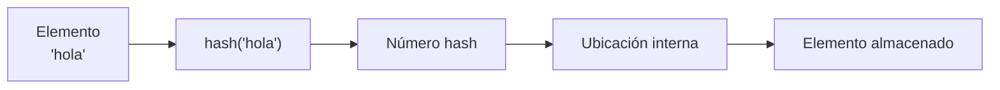
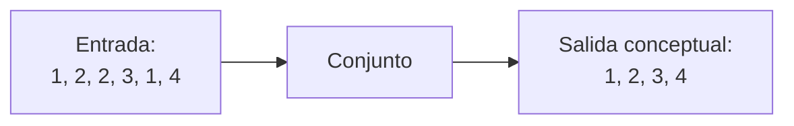
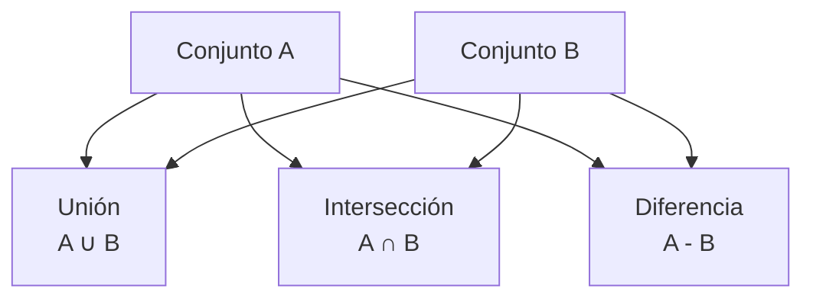

# Conjuntos

## ¿Qué son?

Los conjuntos son estructuras de datos diseñadas para almacenar **elementos únicos**. Su principal objetivo es permitir búsquedas rápidas y evitar duplicados automáticamente. Internamente utilizan mecanismos de hashing para optimizar el acceso.

---

## Mecanismo de hashing

---

## Eliminación automática de duplicados

---

## Operaciones matemáticas

---

## Características principales

- No admiten duplicados.
- Son mutables.
- Son iterables.
- Utilizan hashing.
- Permiten operaciones matemáticas de conjuntos.
- No poseen acceso por índice.

---

## Complejidad de operaciones

| Operación | Complejidad |
|---|---|
| Verificar pertenencia | O(1) promedio |
| Agregar | O(1) promedio |
| Eliminar | O(1) promedio |

---

## ¿Cuándo utilizar esta estructura?

- Cuando se necesita unicidad.
- Cuando las búsquedas son muy frecuentes.
- Para eliminar duplicados.
- Para operaciones matemáticas entre colecciones.

## ¿Cuándo evitar esta estructura?

- Cuando el orden es importante.
- Cuando se necesita acceso por índice.
- Cuando se requieren elementos repetidos.

---

## Ventajas y limitaciones

=== "Ventajas"
    - Búsquedas muy rápidas.
    - Eliminación automática de duplicados.
    - Operaciones matemáticas eficientes.
    - Excelente rendimiento para verificación de pertenencia.

=== "Limitaciones"
    - No poseen indexación.
    - Solo almacenan elementos hashables.
    - No están diseñados para acceso secuencial.

---

## Comparación con Lista

| Característica | Conjunto | Lista |
|---|---|---|
| Duplicados | ❌ | ✅ |
| Índices | ❌ | ✅ |
| Búsqueda | O(1) | O(n) |
| Orden secuencial | ❌ | ✅ |
