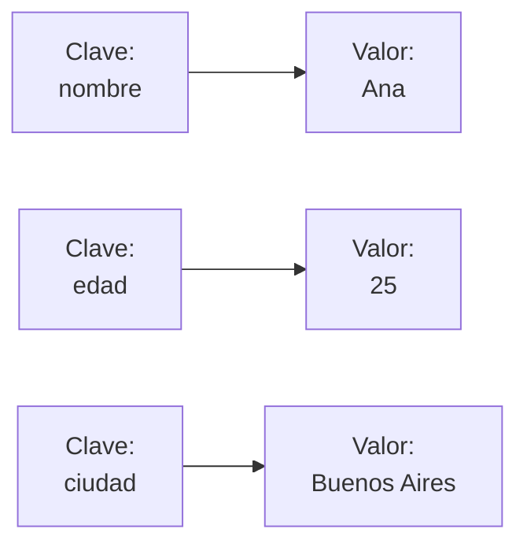
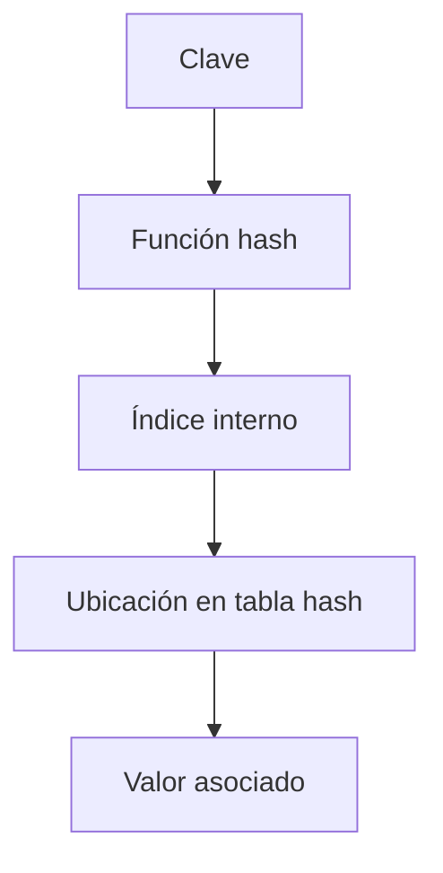
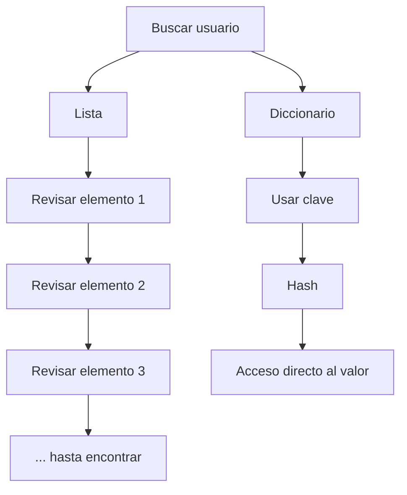

# Diccionarios

## ¿Qué son?

Los diccionarios son estructuras de datos que almacenan información en forma de **pares clave-valor**. A diferencia de las listas y las tuplas, donde los elementos se localizan mediante posiciones numéricas, en los diccionarios cada valor se accede mediante una clave identificadora.

---

## Representación conceptual

---

## Mecanismo interno: tabla hash

---

## Búsqueda por clave vs. búsqueda en lista

---

## Características principales

- Almacenan pares clave-valor.
- Las claves deben ser únicas.
- Mantienen el orden de inserción (Python 3.7+).
- Permiten acceso directo por clave.
- Son mutables.
- Son iterables.
- Utilizan tablas hash internamente.

---

## Complejidad de operaciones

| Operación | Complejidad |
|---|---|
| Acceso por clave | O(1) |
| Inserción | O(1) |
| Eliminación | O(1) |
| Búsqueda de clave | O(1) |

---

## ¿Cuándo utilizar esta estructura?

- Cuando se necesita acceso rápido mediante identificadores.
- Cuando los datos poseen nombres significativos.
- Para representar configuraciones.
- Para almacenar información tipo JSON.
- Para conteo de frecuencias.
- Para agrupaciones de datos.
- Para cache de resultados.

## ¿Cuándo evitar esta estructura?

- Cuando el acceso principal sea por posición numérica.
- Cuando se necesite una colección puramente secuencial.
- Cuando los datos sean extremadamente simples y una lista resulte suficiente.

---

## Ventajas y limitaciones

=== "Ventajas"
    - Acceso extremadamente rápido.
    - Claves descriptivas.
    - Gran flexibilidad.
    - Inserciones eficientes.
    - Excelente para modelar información estructurada.

=== "Limitaciones"
    - Mayor consumo de memoria.
    - No permiten claves duplicadas.
    - No poseen indexación numérica directa.
    - Requieren claves hashables.

---

## Comparación con Lista

| Característica | Diccionario | Lista |
|---|---|---|
| Acceso principal | Clave | Índice |
| Complejidad acceso | O(1) | O(1) |
| Claves descriptivas | ✅ | ❌ |
| Duplicados | ❌ en claves | ✅ |
| Orden secuencial | Secundario | Principal |
