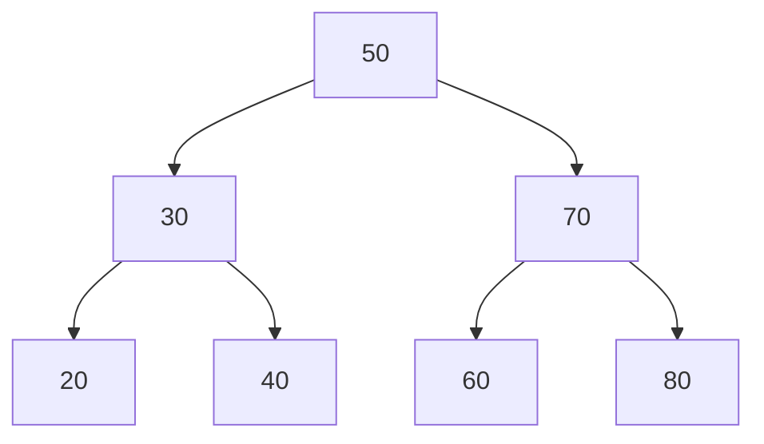
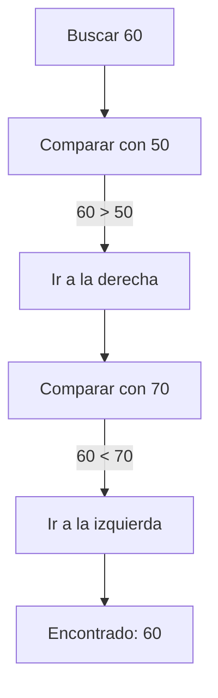
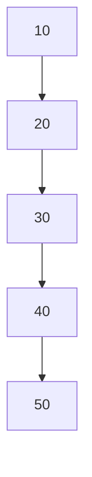
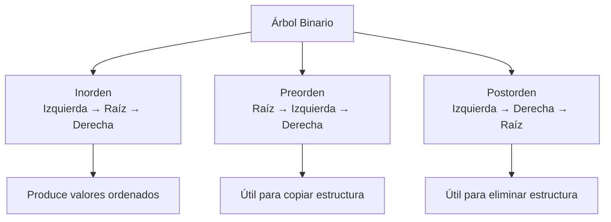

# Árboles Binarios de Búsqueda (BST)

## ¿Qué son?

Los Árboles Binarios de Búsqueda (Binary Search Trees o **BST**) son estructuras jerárquicas organizadas mediante nodos. Cada nodo puede tener como máximo dos hijos: un hijo izquierdo y un hijo derecho.

Su principal característica consiste en **mantener los datos ordenados automáticamente**.

---

## Estructura de un BST

!!! note "Propiedad fundamental"
    Para cualquier nodo: todos los valores del subárbol **izquierdo** son **menores**, y todos los del subárbol **derecho** son **mayores**.

---

## Proceso de búsqueda

---

## BST degenerado

Cuando se insertan elementos ya ordenados, el árbol degenera en una lista:

!!! warning "Peor caso"
    En un árbol degenerado, la búsqueda pasa de O(log n) a O(n).

---

## Tipos de recorrido

---

## Complejidad de operaciones

=== "Árbol balanceado"

    | Operación | Complejidad |
    |---|---|
    | Búsqueda | O(log n) |
    | Inserción | O(log n) |
    | Eliminación | O(log n) |

=== "Árbol degenerado (peor caso)"

    | Operación | Complejidad |
    |---|---|
    | Búsqueda | O(n) |
    | Inserción | O(n) |
    | Eliminación | O(n) |

---

## ¿Cuándo utilizar esta estructura?

- Cuando se necesita mantener datos ordenados.
- Cuando existen muchas búsquedas.
- Cuando los datos cambian dinámicamente.
- Cuando se requieren recorridos ordenados.

## ¿Cuándo evitar esta estructura?

- Cuando los datos son pocos.
- Cuando una lista resulta suficiente.
- Cuando el árbol puede desbalancearse frecuentemente.
- Cuando el acceso principal es por índice.

---

## Ventajas y limitaciones

=== "Ventajas"
    - Mantiene orden automáticamente.
    - Búsquedas eficientes en árbol balanceado.
    - Inserciones dinámicas.
    - Excelente para datos jerárquicos.

=== "Limitaciones"
    - Puede degradarse a O(n).
    - Mayor complejidad conceptual.
    - Consume más memoria que una lista simple.

---

## Comparación con Lista

| Característica | BST | Lista |
|---|---|---|
| Orden automático | ✅ | ❌ |
| Búsqueda promedio | O(log n) | O(n) |
| Acceso por índice | ❌ | ✅ |
| Inserción ordenada | Eficiente | Costosa |
