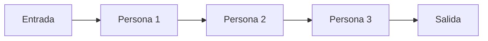
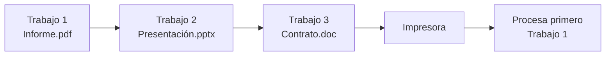

# Colas (Queue)

## ¿Qué son?

Las colas son estructuras lineales especializadas que siguen el principio:

!!! info "FIFO — First In, First Out"
    El primer elemento que entra es el primero que sale.

---

## Representación conceptual

---

## Caso de uso: Cola de impresión

---

## Características principales

- Estructura lineal.
- Procesamiento por orden de llegada.
- Acceso restringido a los extremos.
- Inserción y eliminación eficientes.

---

## Complejidad de operaciones

| Operación | Complejidad |
|---|---|
| Enqueue (encolar) | O(1) |
| Dequeue (desencolar) | O(1) |
| Consultar frente | O(1) |

---

## ¿Cuándo utilizar esta estructura?

- Procesamiento de mensajes.
- Sistemas de impresión.
- Simulación de filas.
- Gestión de tareas.
- Búsqueda en amplitud (BFS).
- Atención de clientes.

## ¿Cuándo evitar esta estructura?

- Cuando se necesita acceso aleatorio.
- Cuando el último elemento debe procesarse primero.
- Cuando se requiere modificar elementos internos constantemente.

---

## Ventajas y limitaciones

=== "Ventajas"
    - Procesamiento justo por orden de llegada.
    - Fácil implementación.
    - Muy eficiente.
    - Modela numerosos sistemas reales.

=== "Limitaciones"
    - Acceso restringido.
    - No posee indexación.
    - No facilita búsquedas internas.

---

## Comparación con Pila

| Característica | Cola | Pila |
|---|---|---|
| Principio | FIFO | LIFO |
| Procesamiento | Orden llegada | Orden inverso |
| Uso típico | Turnos | Deshacer |
