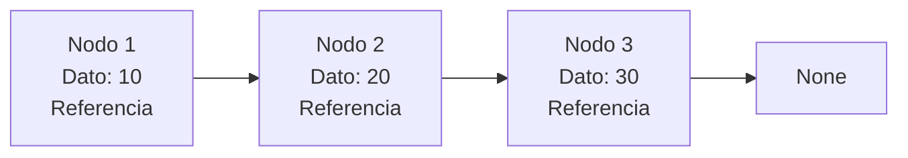
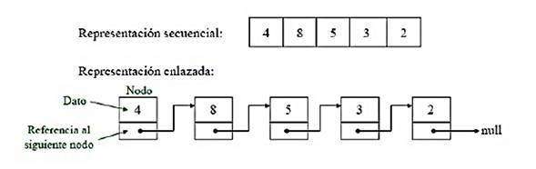
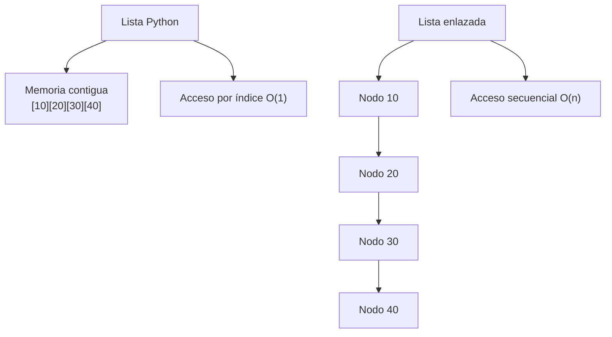
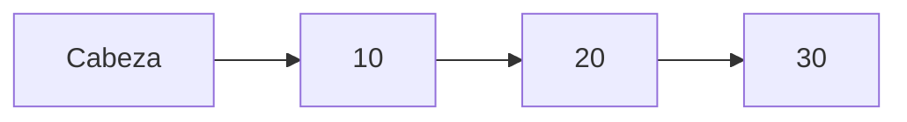
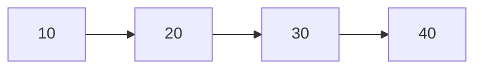

# Listas Enlazadas

## ¿Qué son?

Las listas enlazadas son estructuras dinámicas formadas por **nodos**. Cada nodo almacena un dato y una referencia al siguiente nodo. A diferencia de las listas secuenciales, los elementos no necesitan estar almacenados en posiciones contiguas de memoria.

---

## Estructura de nodos

---
## Representación lista Enlazada Simple vs Lista Secuencial

---

## Inserción en la cabeza — O(1)

---

## Lista Python vs. Lista Enlazada

---

## Características principales

- Estructura dinámica.
- Basada en nodos.
- No requiere memoria contigua.
- Inserciones eficientes en la cabeza.
- Recorrido secuencial.

---

## Complejidad de operaciones

Es importante notar que las inserciones y eliminaciones eficientes en listas enlazadas ocurren solamente en ciertos escenarios.

Si ya se conoce el nodo donde se realizará la operación (por ejemplo, la cabeza o una referencia previamente obtenida), insertar o eliminar puede hacerse en tiempo constante.

Sin embargo, si primero es necesario encontrar esa posición recorriendo la lista, aparece un costo adicional de búsqueda.

| Operación | Complejidad | Observación 
|---|---|---|
| Acceso a posición | O(n) | Requiere recorrer nodos | 
| Búsqueda | O(n) | Puede recorrer toda la estructura |
| Inserción en cabeza | O(1) | No requiere búsqueda |
| Eliminación en cabeza | O(1) | No requiere búsqueda |
| Inserción en posición conocida | O(1) | Ya se dispone del nodo |
| Eliminación en posición conocida | O(1) | Ya se dispone del nodo |
| Inserción buscando posición | O(n) | Buscar + insertar |
| Eliminación buscando posición | O(n) | Buscar + eliminar |

---

## Ejemplos conceptuales

=== Caso eficiente — O(1)

  Insertar antes de 10
  Solo se actualizan referencias.

===Caso no eficiente — O(n)

   Se desea insertar después del valor 30.

   Primero hay que encontrar el nodo 30.

   El recorrido introduce costo lineal.

   Por eso, el costo total deja de ser O(1).

---  

## ¿Cuándo utilizar esta estructura?

- Muchas inserciones y eliminaciones.
- Tamaño altamente variable.
- Implementación de pilas y colas.
- Gestión dinámica de memoria.

## ¿Cuándo evitar esta estructura?

- Cuando el acceso por índice es frecuente.
- Cuando se necesitan búsquedas rápidas.
- Cuando el recorrido secuencial representa un costo elevado.

---

## Ventajas y limitaciones

=== "Ventajas"
    - Muy flexibles.
    - Crecimiento dinámico.
    - Inserciones eficientes en la cabeza.
    - Eliminaciones eficientes en la cabeza.

=== "Limitaciones"
    - Mayor consumo de memoria por referencias.
    - Acceso lento a posiciones arbitrarias.
    - Mayor complejidad conceptual.

---

## Comparación con Lista Secuencial

| Característica | Lista Enlazada | Lista Secuencial |
|---|---|---|
| Acceso por índice | O(n) | O(1) |
| Inserción inicio | O(1) | O(n) |
| Eliminación inicio | O(1) | O(n) |
| Memoria contigua | ❌ | ✅ |
| Complejidad conceptual | Mayor | Menor |
