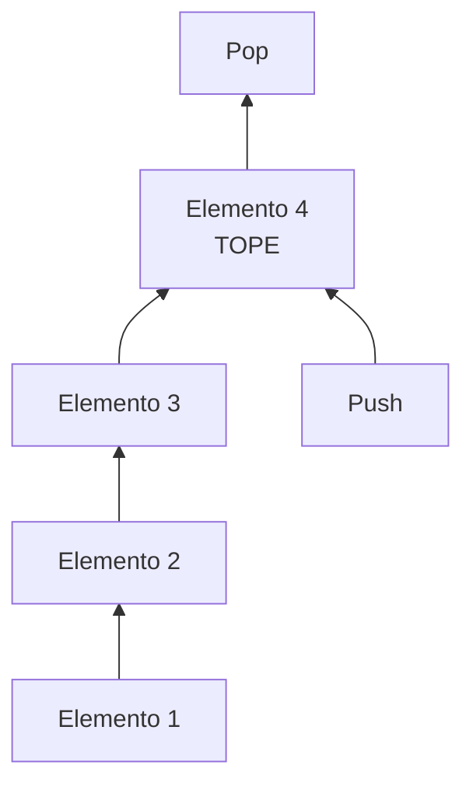
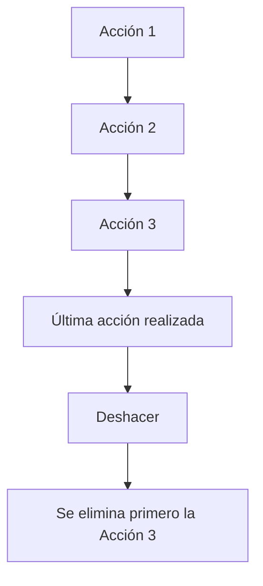

# Pilas (Stack)

## ¿Qué son?

Las pilas son estructuras lineales especializadas que siguen el principio:

!!! info "LIFO — Last In, First Out"
    El último elemento que entra es el primero que sale.

Las pilas restringen el acceso a un único extremo denominado **tope**.

---

## Representación conceptual

---

## Caso de uso: Deshacer acciones

---

## Características principales

- Son estructuras lineales.
- Siguen el principio LIFO.
- Acceso restringido al tope.
- Inserción y eliminación muy eficientes.
- Implementación sencilla.

---

## Complejidad de operaciones

| Operación | Complejidad |
|---|---|
| Push (apilar) | O(1) |
| Pop (desapilar) | O(1) |
| Consultar tope | O(1) |

---

## ¿Cuándo utilizar esta estructura?

- Funcionalidades deshacer/rehacer.
- Llamadas a funciones.
- Procesamiento recursivo.
- Navegación hacia atrás en navegadores.
- Evaluación de expresiones matemáticas.
- Algoritmos DFS (búsqueda en profundidad).

## ¿Cuándo evitar esta estructura?

- Cuando se necesite acceso aleatorio.
- Cuando se requiera procesar elementos por orden de llegada.
- Cuando se necesite acceder a elementos intermedios frecuentemente.

---

## Ventajas y limitaciones

=== "Ventajas"
    - Muy eficiente.
    - Implementación simple.
    - Excelente para problemas recursivos.
    - Consumo moderado de recursos.

=== "Limitaciones"
    - Acceso extremadamente restringido.
    - No permite búsquedas eficientes.
    - No permite acceso directo a elementos internos.

---

## Comparación con Cola

| Característica | Pila | Cola |
|---|---|---|
| Principio | LIFO | FIFO |
| Inserción | Un extremo | Un extremo |
| Eliminación | Mismo extremo | Extremo opuesto |
| Uso típico | Deshacer | Procesamiento secuencial |
