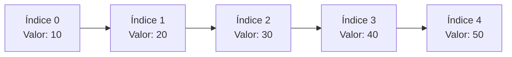
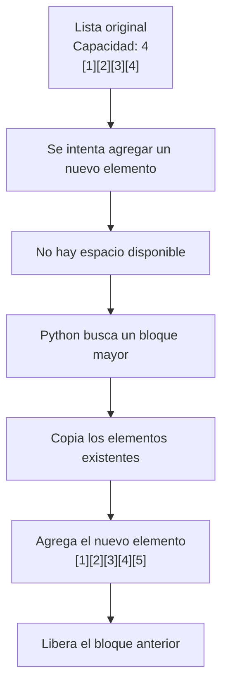
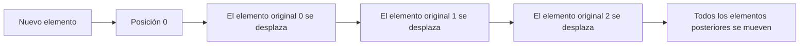

# Listas Secuenciales

## ¿Qué son?

Las listas son estructuras de datos secuenciales que almacenan elementos manteniendo un orden determinado. Cada elemento ocupa una posición identificada mediante un índice numérico.

Las listas son una de las estructuras más utilizadas en programación debido a su flexibilidad y facilidad de uso.

---

## Representación conceptual

---

## Características principales

- Son secuenciales.
- Mantienen el orden de inserción.
- Son mutables.
- Permiten elementos repetidos.
- Admiten distintos tipos de datos.
- Poseen tamaño dinámico.

---

## Implementación interna

Aunque en Python se usa el nombre list, internamente su comportamiento se aproxima más al de un array dinámico (vector dinámico).

Un array dinámico es una estructura que almacena elementos en posiciones consecutivas y que tiene la capacidad de crecer o reducirse automáticamente cuando es necesario.

Para lograrlo, el sistema reserva espacio adicional y, cuando ese espacio se agota, crea un bloque más grande y reorganiza los elementos.

Esta implementación permite que:

- Acceder mediante índices sea muy eficiente.
- Agregar elementos al final normalmente sea rápido.
- Algunas inserciones o eliminaciones requieran reorganizar parte de la estructura.

---

## Crecimiento dinámico de memoria

Cuando una lista se queda sin espacio, Python busca un bloque mayor, copia los elementos y libera el bloque anterior:

---

## Inserción al inicio

Insertar al comienzo requiere desplazar todos los elementos:

---

## Complejidad de operaciones

| Operación | Complejidad |
|---|---|
| Acceso por índice | O(1) |
| Agregar al final | O(1) amortizado |
| Insertar al inicio | O(n) |
| Eliminar elemento | O(n) |
| Búsqueda | O(n) |

---

## ¿Cuándo utilizar esta estructura?

- Cuando el orden de los datos es importante.
- Cuando se necesita acceder mediante índices.
- Cuando pueden existir elementos repetidos.
- Cuando la cantidad de elementos puede variar dinámicamente.
- Cuando se requiere recorrer la colección frecuentemente.

## ¿Cuándo evitar esta estructura?

- Cuando las búsquedas son la operación dominante.
- Cuando se necesitan inserciones frecuentes al inicio.
- Cuando se requiere garantizar unicidad automáticamente.
- Cuando se trabaja con grandes volúmenes de datos numéricos y el rendimiento es crítico.

---

## Ventajas y limitaciones

=== "Ventajas"
    - Fácil de utilizar.
    - Acceso por índice muy rápido.
    - Flexible.
    - Permite datos heterogéneos.
    - Tamaño dinámico.

=== "Limitaciones"
    - Búsquedas lineales.
    - Inserciones costosas al inicio.
    - Consumo de memoria superior al de arrays especializados.

---

## Comparación con Tupla

| Característica | Lista | Tupla |
|---|---|---|
| Mutable | ✅ | ❌ |
| Ordenada | ✅ | ✅ |
| Acceso por índice | ✅ | ✅ |
| Tamaño dinámico | ✅ | ❌ |
