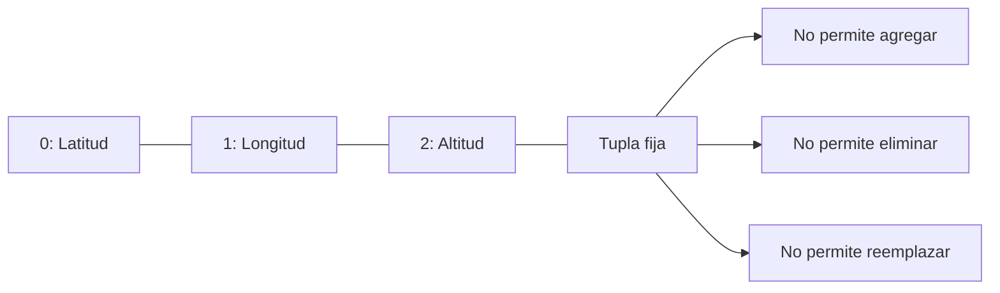
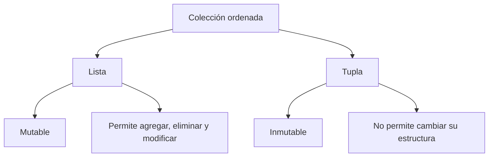

# Tuplas

## ¿Qué son?

Las tuplas son estructuras secuenciales e **inmutables** que permiten almacenar una colección ordenada de elementos. Su principal diferencia respecto a las listas es que una vez creada una tupla, su estructura no puede modificarse.

---

## Representación conceptual

---

## Tupla vs. Lista

---

## Características principales

- Son secuenciales.
- Mantienen orden.
- Son **inmutables**.
- Permiten elementos repetidos.
- Admiten datos heterogéneos.
- Son iterables.

---

## Complejidad de operaciones

| Operación | Complejidad |
|---|---|
| Acceso por índice | O(1) |
| Búsqueda | O(n) |

---

## ¿Cuándo utilizar esta estructura?

- Cuando los datos no deben modificarse.
- Para representar coordenadas.
- Para almacenar configuraciones fijas.
- Para claves compuestas en diccionarios.
- Para retornar múltiples valores relacionados.

## ¿Cuándo evitar esta estructura?

- Cuando se necesiten modificaciones frecuentes.
- Cuando la colección crezca dinámicamente.
- Cuando sea necesario eliminar elementos.

---

## Ventajas y limitaciones

=== "Ventajas"
    - Mayor seguridad frente a modificaciones accidentales.
    - Menor consumo de memoria.
    - Hashables en determinadas condiciones.
    - Muy apropiadas para datos constantes.

=== "Limitaciones"
    - No pueden modificarse.
    - No permiten agregar elementos.
    - Menor flexibilidad que las listas.

---

## Comparación con Lista

| Característica | Tupla | Lista |
|---|---|---|
| Mutable | ❌ | ✅ |
| Ordenada | ✅ | ✅ |
| Repetidos | ✅ | ✅ |
| Tamaño dinámico | ❌ | ✅ |
