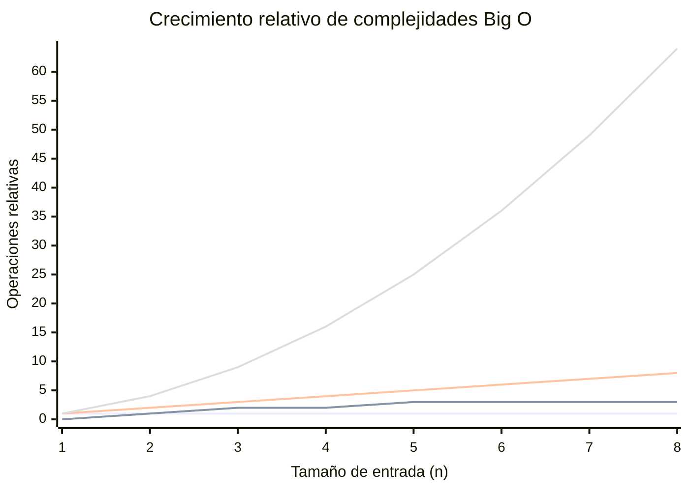

# Complejidad Computacional y Notación Big O

## ¿Por qué es importante medir la eficiencia?

Cuando un programa trabaja con pocos datos, casi cualquier solución parece funcionar correctamente.

Sin embargo, cuando la cantidad de datos crece significativamente, ciertas soluciones pueden volverse extremadamente lentas.

La notación Big O permite estimar cómo crecerá el tiempo de ejecución o el consumo de recursos de un algoritmo a medida que aumenta la cantidad de datos procesados.

---

## Crecimiento relativo de complejidades

---

## Complejidades más frecuentes

| Complejidad | Nombre | Comportamiento |
|---|---|---|
| O(1) | Constante | El tiempo no depende del tamaño de los datos |
| O(log n) | Logarítmica | Crecimiento muy lento |
| O(n) | Lineal | Crece proporcionalmente a los datos |
| O(n log n) | Lineal-Logarítmica | Muy eficiente para ordenamientos |
| O(n²) | Cuadrática | Crece rápidamente |
| O(2ⁿ) | Exponencial | Crecimiento explosivo |

---

## Interpretación intuitiva

### O(1) — Constante

El tiempo necesario para realizar una operación es prácticamente constante.

**Ejemplos:**

- Acceder a un elemento por índice en una lista.
- Consultar un valor por clave en un diccionario.

---

### O(log n) — Logarítmica

Cada operación reduce significativamente el espacio de búsqueda.

**Ejemplos:**

- Búsqueda binaria.
- Algunas operaciones en árboles balanceados.

---

### O(n) — Lineal

Es necesario recorrer todos los elementos.

**Ejemplos:**

- Buscar un elemento en una lista sin ordenar.
- Recorrer completamente una colección.

---

### O(n²) — Cuadrática

Cada elemento debe compararse con muchos otros.

**Ejemplos:**

- Bubble Sort.
- Selection Sort.
- Algunos algoritmos de fuerza bruta.

---

## Regla práctica

!!! success "Ordenamiento de preferencia"
    Siempre que sea posible:

    **O(1) > O(log n) > O(n) > O(n log n) > O(n²) > O(2ⁿ)**
