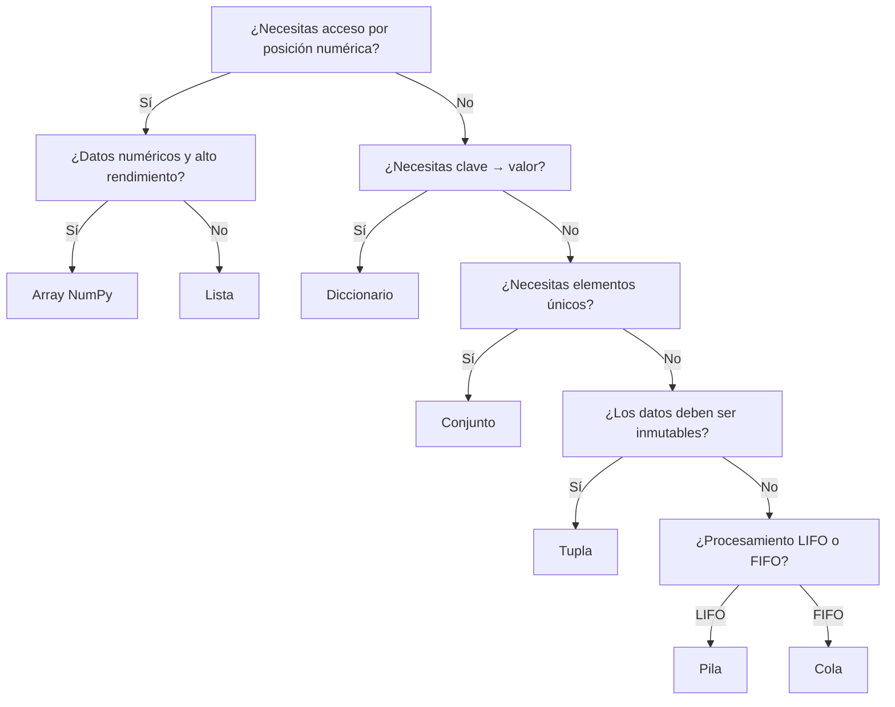

# Introducción a las Estructuras de Datos

## ¿Qué es una estructura de datos?

Una estructura de datos es una forma organizada de almacenar y administrar información dentro de un programa para facilitar su acceso, modificación y procesamiento.

La elección de una estructura de datos adecuada tiene un impacto directo sobre:

- El rendimiento de una aplicación.
- El consumo de memoria.
- La facilidad de implementación.
- La complejidad de los algoritmos utilizados.

!!! tip "Principio fundamental"
    No existe una estructura de datos universalmente mejor que otra. Cada una fue diseñada para resolver determinados problemas de manera eficiente.

Por esta razón, uno de los conocimientos más importantes para un programador consiste en saber seleccionar la estructura adecuada según las operaciones que realizará con mayor frecuencia.

---

## ¿Cómo elegir?

---

## Estructuras que veremos

| Estructura | Tipo | Uso principal |
|---|---|---|
| Lista | Secuencial | Colecciones ordenadas y mutables |
| Tupla | Secuencial | Datos inmutables |
| Conjunto | Hash | Unicidad y pertenencia rápida |
| Diccionario | Hash | Búsqueda por clave |
| Pila | Lineal | LIFO: deshacer, recursión |
| Cola | Lineal | FIFO: procesamiento por orden |
| Lista Enlazada | Dinámica | Inserciones y eliminaciones frecuentes |
| Array NumPy | Especializada | Cálculo numérico eficiente |
| BST | Jerárquica | Datos ordenados dinámicamente |
