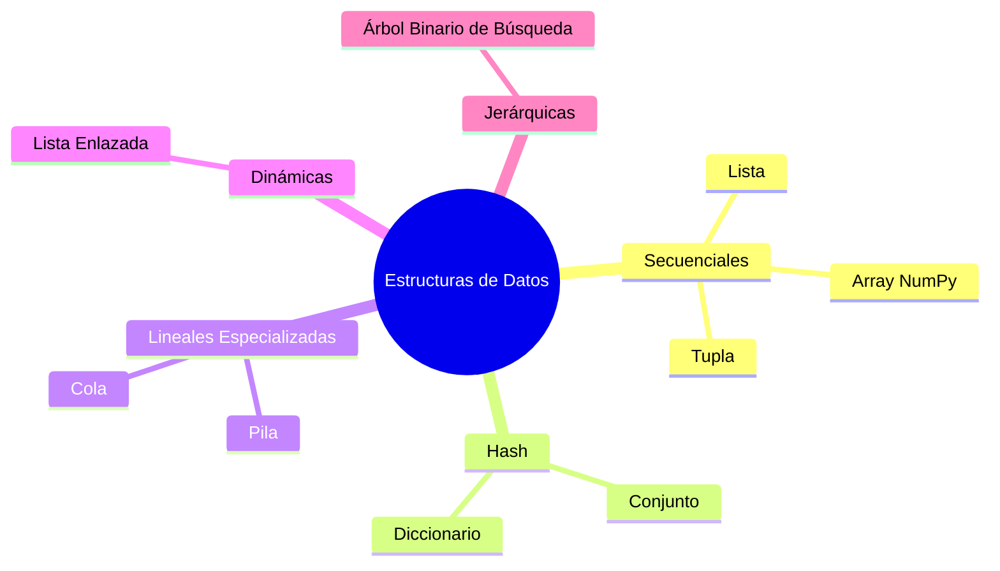

# Estructuras de Datos en Python

Material de referencia para la materia **Informática General 71.45** — ITBA.

Está orientado a estudiantes que ya programan en Python y quieren profundizar su comprensión de las estructuras de datos fundamentales, sus características, complejidades y criterios de selección.

Bienvenidos a este recorrido conceptual. Comprender las estructuras de datos es uno de los pilares del pensamiento computacional: permite escribir soluciones más eficientes, más claras y más adecuadas para cada problema.

No existe una estructura de datos universalmente superior. Cada una fue diseñada para optimizar determinadas operaciones. El objetivo de este material es darte los elementos para tomar esa decisión con criterio.

---

## Prerequisitos

- Python 3.10 o superior.
- Conocimientos básicos de Python: variables, funciones, `if`, `for` y listas.

---

## ¿Qué vas a aprender?

- [Qué es una estructura de datos y por qué importa elegirla bien](fundamentos/introduccion.md)
- [Cómo medir la eficiencia de un algoritmo con notación Big O](fundamentos/big-o.md)
- [Listas y tuplas: estructuras secuenciales y sus diferencias clave](estructuras-secuenciales/listas.md)
- [Conjuntos y diccionarios: estructuras basadas en hashing](estructuras-hash/conjuntos.md)
- [Pilas, colas y listas enlazadas: estructuras lineales especializadas](estructuras-lineales/pilas.md)
- [Arrays NumPy: eficiencia para datos numéricos](estructuras-especializadas/arrays-numpy.md)
- [Árboles Binarios de Búsqueda: estructuras jerárquicas ordenadas](estructuras-jerarquicas/bst.md)
- [Cómo seleccionar la estructura adecuada según el problema](referencia/guia-seleccion.md)

---

## Mapa de estructuras

---

## Referencias

- Thomas H. Cormen et al. — *Introduction to Algorithms*
- Al Sweigart — *Automate the Boring Stuff with Python*
- Documentación oficial — [Python Data Structures](https://docs.python.org/3/tutorial/datastructures.html)
- Documentación oficial — [NumPy](https://numpy.org/doc/)
