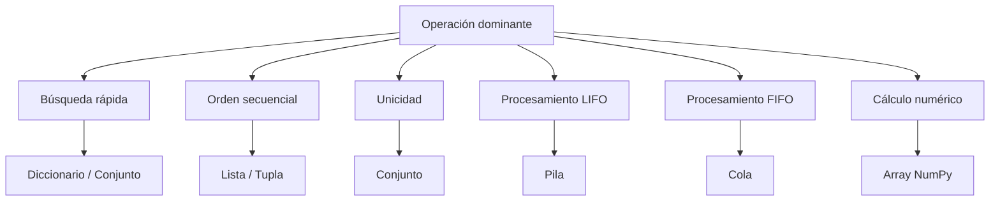
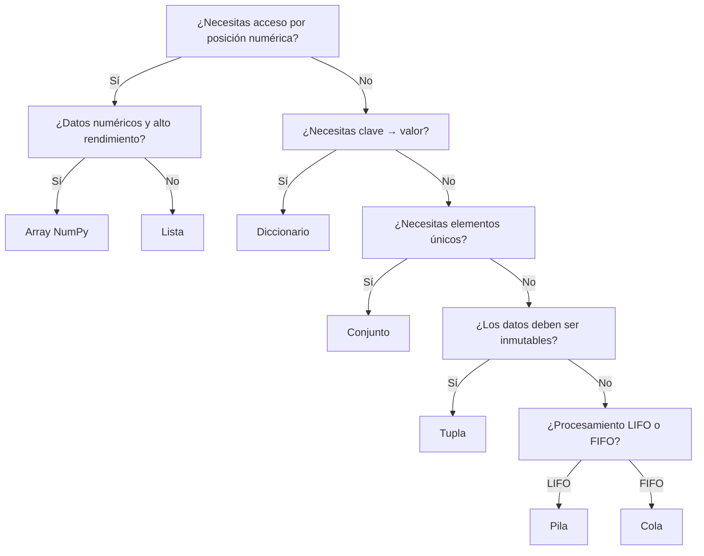

# Guía de Selección de Estructuras

## ¿Cómo elegir la estructura adecuada?

La mejor estructura depende de las operaciones que se ejecutarán con mayor frecuencia. Una estructura excelente para un problema puede ser una mala elección para otro.

---

## Árbol de decisión

---

## Árbol de decisión extendido

---

## Comparación por escenarios

| Necesidad | Estructura recomendada |
|---|---|
| Acceso por índice | Lista |
| Datos inmutables | Tupla |
| Eliminar duplicados | Conjunto |
| Búsqueda por clave | Diccionario |
| Deshacer / Rehacer | Pila |
| Procesamiento por orden de llegada | Cola |
| Inserciones frecuentes al inicio | Lista enlazada |
| Cálculo numérico intensivo | Array NumPy |
| Datos ordenados dinámicamente | BST |
